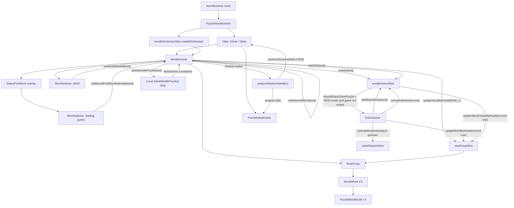

# Puzzles Overview

This repo is a React/TypeScript puzzle app. The Wordle Solver lives at `/wordle/solver` and is made from a route-level screen, a solver workbench, shared Wordle UI components, and a few Redux slices that keep the dictionary, board rows, robot state, and game state in sync.

## Wordle Solver Entry Points

- `src/App.tsx` lazy-loads `PuzzleWordleSolver` for `/wordle/solver`.
- `src/features/wordle/wordlesolver/PuzzleWordleSolver.tsx` owns the Solver/Stats tabs, header setup, dictionary initialization, and handoff into the analyzer tab.
- `src/features/wordle/components/solver/WordleSolver.tsx` owns the main solver controls: starting-word selection, WOD selection, clear/reset, local solution calculation, robot solver wiring, and board rendering.
- `src/features/wordle/components/robot/RobotSolver.tsx` watches robot/game state and drives the visible round-by-round solving loop with timed status transitions.
- `src/features/wordle/components/rowgroup/RowGroup.tsx` renders six `WordleRow` components from `rowGroupSlice` state.
- `src/features/wordle/components/stats/PuzzleDetailsStats.tsx` can receive the last local solution constraints and calculate possible matching words.

## State Map

| Slice                 | Path                                             | Main responsibility                                                                             |
| --------------------- | ------------------------------------------------ | ----------------------------------------------------------------------------------------------- |
| `wordledictionary`    | `components/dictionary/wordleDictionarySlice.ts` | Builds `dictionary.words`, indexed letter lookup, and words grouped by first letter.            |
| `wordle`              | `wordlesolver/wordleSlice.ts`                    | Tracks active Wordle screen and whether the interactive robot is shown.                         |
| `wordlesolver`        | `components/solver/wordleSolverSlice.ts`         | Stores selected WOD, current round, round guesses, and won/lost state for the solver game.      |
| `wordlerobotsolution` | `components/robot/robotSolutionSlice.ts`         | Tracks robot status, attempts, used guesses, clue constraints, and remaining candidate indexes. |
| `ui.rowGroup`         | `components/rowgroup/rowGroupSlice.ts`           | Stores the letters/colors displayed in the six visible Wordle rows.                             |

## Component Flow

This diagram follows the flow from "I chose a starting word" to "the selected WOD starts being solved".

## User-To-Solver Sequence

```mermaid
sequenceDiagram
  actor User
  participant PWS as PuzzleWordleSolver
  participant WS as WordleSolver
  participant Dict as wordledictionary slice
  participant Rows as rowGroup slice
  participant Game as wordlesolver slice
  participant Robot as RobotSolver
  participant RobotState as robotSolution slice

  PWS->>Dict: createDictionary()
  Dict-->>PWS: status = loaded
  PWS->>WS: render solver tab
  WS->>WS: default startingWord = OCEAN
  WS->>Rows: updateWordByRowId(ROW_1, OCEAN)

  User->>WS: select starting word
  WS->>WS: setStartingWord(word)
  WS->>Rows: updateWordByRowId(ROW_1, word)

  User->>WS: select WOD
  WS->>Game: resetGame()
  WS->>WS: setSelectedWord(wod)
  WS->>Game: setWOD(wod)
  WS->>WS: solveWordlePuzzle(wod)

  loop Local calculation until found or 6 attempts
    WS->>WS: makeGuess()
    WS->>WS: getResults()
    WS->>WS: reduce availableWordIndexes
  end

  Game-->>Robot: shouldRobotSolvePuzzle = true

  loop Visible robot rounds until win/loss
    Robot->>RobotState: pickNextGuessWordAndStartSolvingPuzzle()
    RobotState->>Game: addRobotWord(word)
    Game->>Rows: updateWordByRowId(current row, word)
    Robot->>Game: onSubmitRobotGuess()
    Game->>Rows: updateWordColorsByRowId(current row, colors)
    Game->>RobotState: setRobotGuessWordStatus(word, colors)
    Robot->>RobotState: analyzeGuessWordStatus()
    RobotState->>RobotState: reduce candidate indexes
  end
```

## Solution Flow Notes

The selected WOD is stored in two places with two different jobs:

- `WordleSolver` keeps `selectedWord` in local component state so `solveWordlePuzzle()` can compare guesses to the WOD and produce `lastSolution`.
- `wordleSolverSlice` stores `wod` in Redux so `RobotSolver` and `onSubmitRobotGuess()` can drive the visible game loop.

The starting word is also used in two ways:

- The user's chosen starting word is stored locally in `WordleSolver` and written into `ROW_1` immediately.
- The local `makeGuess()` path honors that starting word for attempt 1.
- The visible robot loop currently picks guesses from `robotSolutionSlice` candidate indexes. That means the robot-rendered first row can be overwritten by the robot's chosen guess after a WOD is selected.

The local solver and visible robot solver both reduce possible answers with the same family of helpers from `PuzzleWordle-helpers.ts`:

- `getExactMatches()` keeps words with green letters in the same position.
- `getExistsMatches()` keeps words with orange letters present but not in the rejected position.
- `removeNonExistentLetterIndexes()` removes words containing known missing letters.
- `removeNonExistentLetterIndexesAtIndex()` removes words containing a known invalid letter-position pairing.

The analyzer tab is fed from the local solver path. After a solution exists, `analyzeWord()` copies `lastSolution.exactMatchLetter`, `existsMatchLetter`, and `nonExistentLetters`, calls `analyzeSolutionHandler()`, and `PuzzleWordleSolver` switches the active tab to `WordleScreen.ANALYZER`.
