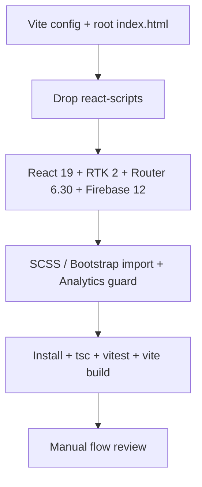

# Project Revival Milestone

> **Created**: 2026-08-23
> **Last Updated**: 2026-08-23
> **Status**: 🚧 In progress — Vite migration started
> **Goal**: Leave Create React App (no eject) and bring Puzzles onto Vite + React 19 + Redux Toolkit 2 + Firebase 12 + TypeScript 5.9, then verify flows

**Reference**: [Montessori Project Revival Milestone](file:///Users/andrey/Development/montessori/docs/milestones-completed/Project-Revival-Milestone.md) (completed 2026-03-04). Montessori stayed on CRA + CRACO. Puzzles is taking the **Vite** path instead.

`src/config/FirebaseConfig.ts` is gitignored. Add it locally from [src/config/FirebaseConfig.example.ts](../../src/config/FirebaseConfig.example.ts) (`export const firebaseConfig = { ... }`).

---

## Current vs target stack

Local environment today: **Node.js v26.0.0**, **npm 11.12.1**. Latest versions checked from npm on 2026-08-23.

| Package                             | Current (puzzles)     | Montessori (working) | Latest on npm    | **Target for this milestone**    | Notes                                                      |
| ----------------------------------- | --------------------- | -------------------- | ---------------- | -------------------------------- | ---------------------------------------------------------- |
| `react` / `react-dom`               | 18.2.0                | 19.2.3               | 19.2.8           | **19.2.8**                       | Major. Expect `useRef` and ref-callback fixes.             |
| `@types/react` / `@types/react-dom` | 18.0.x                | 19.2.x               | 19.2.18 / 19.2.4 | **19.2.x**                       | Must match React 19.                                       |
| `typescript`                        | 4.8.4                 | 6.0.3                | 7.0.2            | **5.9.3** first                  | TS 6/7 after the Vite build is green.                      |
| `@reduxjs/toolkit`                  | 1.8.5                 | 2.11.2               | 2.12.0           | **2.12.0**                       | Major. Review store + thunks.                              |
| `react-redux`                       | 8.0.4                 | 9.2.0                | 9.3.0            | **9.3.0**                        | Required with RTK 2 + React 19.                            |
| `firebase`                          | 9.10.0                | 12.14.0              | 12.18.0          | **12.18.0**                      | Major (9 → 12). Modular API already used.                  |
| `firebase-tools`                    | 11.13.0 (runtime dep) | not in app deps      | 15.28.1          | **15.28.1** as **devDependency** | Hosting CLI only.                                          |
| `react-router-dom`                  | 6.4.2                 | 6.23.1               | 7.18.2           | **6.30.6**                       | Stay on v6. v7 is a separate migration.                    |
| Bundler                             | `react-scripts` 5.0.1 | CRA + CRACO 7.1.0    | Vite 8.2.2       | **Vite 8.2.2**                   | Replaces CRA. No eject.                                    |
| Tests                               | Jest via CRA          | Jest via CRACO       | Vitest 4.1.11    | **Vitest 4.1.11** + jsdom        | Two test files.                                            |
| `bootstrap`                         | 5.2.2                 | —                    | 5.3.8            | **5.3.8**                        | Visual QA after upgrade.                                   |
| `react-bootstrap`                   | 2.5.0                 | —                    | 2.10.10          | **2.10.10**                      | Confirm React 19 peer support.                             |
| `react-bootstrap-icons`             | 1.9.1                 | —                    | 1.11.6           | **1.11.6**                       |                                                            |
| `react-select`                      | 5.4.0                 | —                    | 5.10.2           | **5.10.2**                       | Used by Wordle word pickers.                               |
| `sass`                              | 1.55.0                | 1.99.0               | 1.103.1          | **1.103.1**                      | Watch `@import` vs `@use` (Montessori hit this).           |
| `web-vitals`                        | 2.1.4                 | 5.1.0                | 6.1.1            | **5.1.0** or **6.1.1**           | API changed in v3+. Update `reportWebVitals.ts`.           |
| `@testing-library/react`            | 13.4.0                | 16.3.2               | 16.3.2           | **16.3.2**                       | Needs `@testing-library/dom`.                              |
| `@testing-library/jest-dom`         | 5.16.5                | 6.9.1                | 7.0.1            | **6.9.1** first                  | v7 may need Jest/CRA work. Fix `extend-expect` import.     |
| `@testing-library/user-event`       | 14.4.3                | 14.6.1               | 14.6.6           | **14.6.6**                       |                                                            |
| `@testing-library/dom`              | —                     | 10.4.1               | 10.4.1           | **10.4.1**                       | Required peer for RTL 16.                                  |
| `@types/jest`                       | 27.5.2                | 29.5.12              | 30.0.0           | **29.5.x**                       | CRA still ships Jest 27. Prefer 29 unless tests demand 30. |
| `@types/node`                       | 17.0.45               | 20.12.12             | 26.2.0           | **22.x** or **26.2.0**           | Align with the Node version we standardize on.             |
| `eslint`                            | CRA built-in 8        | 10.3.0               | 10.9.0           | **10.9.0**                       | Flat config (`eslint.config.mjs`).                         |
| `typescript-eslint`                 | —                     | 8.59.2               | 8.67.0           | **8.67.0**                       | Unified package, as in Montessori.                         |
| `ajv`                               | —                     | 8.20.0               | 8.20.0           | **8.20.0**                       | Pin to unblock CRA/ajv conflicts.                          |

### Intentionally not in this milestone

- ~~Stay on CRA + CRACO~~ → replaced by Vite (no eject)
- ~~React Router 6 → 7~~ → keep v6 until the Vite app is green
- ~~TypeScript 6 / 7~~ → land on 5.9.3 first
- Voice narration / Montessori-only product work

---

## Recommended Node / npm

Montessori revival used **Node 22.14.0**. This machine is on **Node 26**. Vite 8 supports current Node; CRA is no longer the constraint.

- [ ] Prove **Node 26** works with Vite; fall back to **Node 22 LTS** if install/build fails
- [ ] Fix local npm cache ownership if installs fail (`~/.npm` is currently root-owned on this machine)
- [ ] Prefer a writable npm cache if `EPERM` appears (`npm_config_cache` in `$TMPDIR`)

---

## Milestone phases

### Phase 1: Review state of the app

**Status**: 🚧 Partial (this doc)

- [ ] Confirm `npm start` / `npm test` / `npm run build` work **before** any upgrade
- [ ] Record Node, npm, and `npm outdated` baseline
- [ ] Inventory tests (only [src/App.test.tsx](../../src/App.test.tsx) and [src/features/wordle/PuzzleWordle-helpers.test.ts](../../src/features/wordle/PuzzleWordle-helpers.test.ts); App test is skipped via `xtest`)
- [ ] Note leftover file: `src/features/wordle/components/solver/WordleSolver copy.tsx`
- [ ] Add `.github/copilot-instructions.md` after architecture is documented (Montessori Phase 1)

#### Already known

- CRA + Redux Toolkit TS template, last meaningfully on 2022-era packages
- Firebase Hosting (`firebase.json` → `build/`)
- Modular Firebase init already in [src/firebase/Firebase.ts](../../src/firebase/Firebase.ts) (`initializeApp`, `getAnalytics`)
- No CRACO, no ESLint flat config, no `.github` docs
- TypeScript `target` is still `es5`

---

### Phase 2: Vite + package upgrades

**Status**: 🚧 In progress

- [x] Add `vite.config.ts`, root `index.html`, `eslint.config.mjs`
- [x] Replace `react-scripts` with Vite / Vitest scripts
- [x] Point Firebase Hosting at `dist/`
- [x] Guard Analytics for non-browser (Vitest)
- [x] Type React 19 refs
- [x] `npm install` and lockfile
- [x] `npm run typescript:check`
- [x] `npm run test:run`
- [x] `npm run build` writes `dist/`
- [ ] Manual `npm start` smoke test

---

### Phase 3: Review current flows

**Status**: 🔜 Planned (after Phase 2 build is green)

#### User flows

- [ ] Home / puzzle picker (`/`)
- [ ] Wordle Solver (`/wordle/solver`)
- [ ] Wordle Versus (`/wordle/versus`)
- [ ] On-screen keyboard + physical keyboard
- [ ] Dictionary offcanvas + word lookup
- [ ] Robot solver path
- [ ] Game settings / word selector (`react-select`)

#### Technical flows

- [ ] Redux store boots without runtime errors
- [ ] Lazy routes + suspense loaders
- [ ] Firebase Analytics initializes in production build
- [ ] `firebase deploy` hosting still serves `dist/`
- [ ] Mobile / desktop layout smoke test

---

### Phase 4: Analyze working vs not working

**Status**: 🔜 Planned

Fill this in after Phase 3. Seed issues already visible:

1. **App test is skipped** (`test.skip` in `App.test.tsx`)
2. **Duplicate solver file** (`WordleSolver copy.tsx`)
3. **Footer year still 2010–2022**

---

### Phase 5: Action plan after upgrades

**Status**: 🔜 Planned

Not the focus of this doc. After versions land, split product work into a follow-up milestone (docs, copilot instructions, test revival, optional Router 7 / TS 6–7).

---

## Upgrade order (short)

---

## Success criteria

- [ ] No `react-scripts` / CRACO
- [ ] `npm run typescript:check` passes
- [ ] `npm run test:run` passes
- [ ] `npm run build` writes `dist/`
- [ ] Solver and Versus still playable
- [ ] Hosting `public` is `dist`

---

## Progress log

### 2026-08-23

- Created this milestone and version matrix
- Switched target from CRA + CRACO to Vite
- User added local `FirebaseConfig.ts` (`firebaseConfig` export)
- Started Phase 2: Vite config, package.json, TS 5.9, React 19 ref types, Hosting → `dist`
- Clean `npm install` after removing leftover CRA `node_modules` / lockfile
- Typecheck, Vitest (5 passed, 1 skipped), and `vite build` are green
- Sass `@import` deprecation warnings remain (Bootstrap + existing mixins); not blocking

---

## Notes

- Do not commit `src/config/FirebaseConfig.ts`
- `firebase-tools` stays a **devDependency**
- Do not paper over new TS errors with `@ts-ignore` / weaker `tsconfig` / `any`
- Fallback if Vite is unblockable: CRA + CRACO (Montessori path), still no eject
